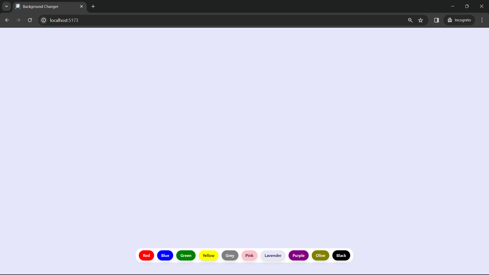

## 🚀 About Me

You can visit....
https://github.com/DATTU005

## Preview



# Background Changer

This project is a React application that allows users to change the background color of the page by selecting from a set of predefined colors. It leverages the Tailwind CSS framework for styling and utilizes the Vite.js build tool for efficient development and bundling.

# Technologies Used

1. React.js: The project is built using the React.js library, which facilitates the creation of interactive and reusable user interfaces.

2. Tailwind CSS: Styling is done using Tailwind CSS, a utility-first CSS framework. This allows for quick and efficient styling without the need for writing custom CSS.

3. Vite.js: The project utilizes Vite.js as the build tool. Vite.js is a fast and opinionated build tool that aims to provide a better development experience for modern web projects.

# Functionality

The main functionality of the application includes:

Changing the background color of the page by clicking on buttons with different color options.

## Run Locally

Clone the project

```bash
  git clone https://github.com/DATTU005/react-projects.git
```

Go to the project directory

```bash
  cd basic
  cd background-changer
```

Install dependencies

```bash
  npm install
```

Start the server

```bash
  npm run dev
```

Open in the browser: Visit http://localhost:5173 in your browser to see the application.

## 🛠 Skills

Javascript, HTML, Tailwind CSS, React.js, Vite.js

## Tech Stack

**Client:** React, TailwindCSS, Vite
