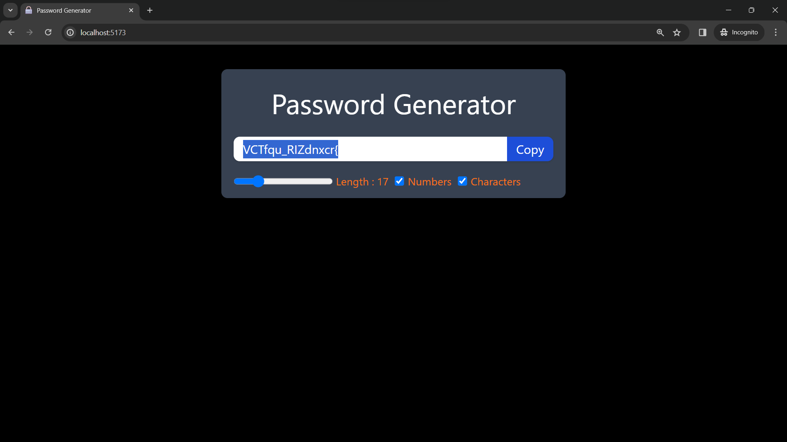

## 🚀 About Me

You can visit....
https://github.com/DATTU005

## Preview



# Password Generator

This project is a React application that serves as a password generator. Users can customize the password's length and choose whether to include numbers and special characters. The application is built using React.js, with styling done using Tailwind CSS. The project is set up and bundled using Vite.js for a seamless development experience.

# Technologies Used

1. React.js: The project is built using the React.js library, which facilitates the creation of interactive and reusable user interfaces.

2. Tailwind CSS: Styling is done using Tailwind CSS, a utility-first CSS framework. This allows for quick and efficient styling without the need for writing custom CSS.

3. Vite.js: The project utilizes Vite.js as the build tool. Vite.js is a fast and opinionated build tool that aims to provide a better development experience for modern web projects.

# Functionality

The key features of the password generator include:

1. Password Generation: The application generates a random password based on user-defined criteria, including length, the inclusion of numbers, and the inclusion of special characters.

2. Clipboard Copy: Users can easily copy the generated password to the clipboard with the click of a button.

3. Dynamic Updates: The password is dynamically updated based on user input, such as changes in length or the inclusion/exclusion of numbers and special characters.

## Run Locally

Clone the project

```bash
  git clone https://github.com/DATTU005/react-projects.git
```

Go to the project directory

```bash
  cd basic
  cd password-generator
```

Install dependencies

```bash
  npm install
```

Start the server

```bash
  npm run dev
```

Open in the browser: Visit http://localhost:5173 in your browser to see the application.

## 🛠 Skills

Javascript, HTML, Tailwind CSS, React.js, Vite.js

## Tech Stack

**Client:** React, TailwindCSS, Vite
