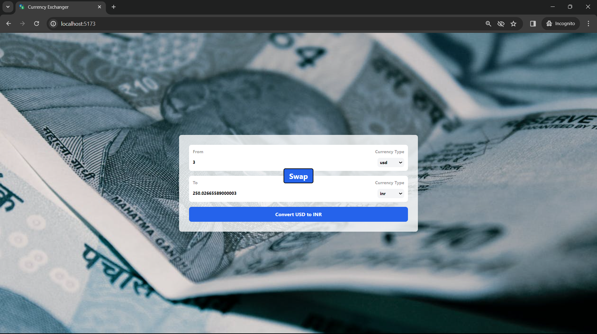

## 🚀 About Me

You can visit....
https://github.com/DATTU005

## Preview



# Currency Exchanger

This project is a currency converter built using React.js, Tailwind CSS, and Vite.js. It allows users to convert an amount from one currency to another. The application features dynamic input boxes, the ability to swap currencies, and a visually appealing design with Tailwind CSS.

# Technologies Used

1. React.js: The project is built using the React.js library, which facilitates the creation of interactive and reusable user interfaces.

2. Tailwind CSS: Styling is done using Tailwind CSS, a utility-first CSS framework. This allows for quick and efficient styling without the need for writing custom CSS.

3. Vite.js: The project utilizes Vite.js as the build tool. Vite.js is a fast and opinionated build tool that aims to provide a better development experience for modern web projects.

# Functionality

The key features of the Currency Exchanger include:

1. Currency Conversion: Users can input an amount, select the source currency (From), choose the target currency (To), and convert the amount with a single click.

2. Swapping Currencies: The application provides a "Swap" button to quickly switch between the source and target currencies.

3. Dynamic Input Boxes: The input boxes for amount and currency type dynamically update based on user interactions, providing a seamless and intuitive user interface.

## Run Locally

Clone the project

```bash
  git clone https://github.com/DATTU005/react-projects.git
```

Go to the project directory

```bash
  cd basic
  cd currency-exchanger
```

Install dependencies

```bash
  npm install
```

Start the server

```bash
  npm run dev
```

Open in the browser: Visit http://localhost:5173 in your browser to see the application.

## 🛠 Skills

Javascript, HTML, Tailwind CSS, React.js, Vite.js

## Tech Stack

**Client:** React, TailwindCSS, Vite
