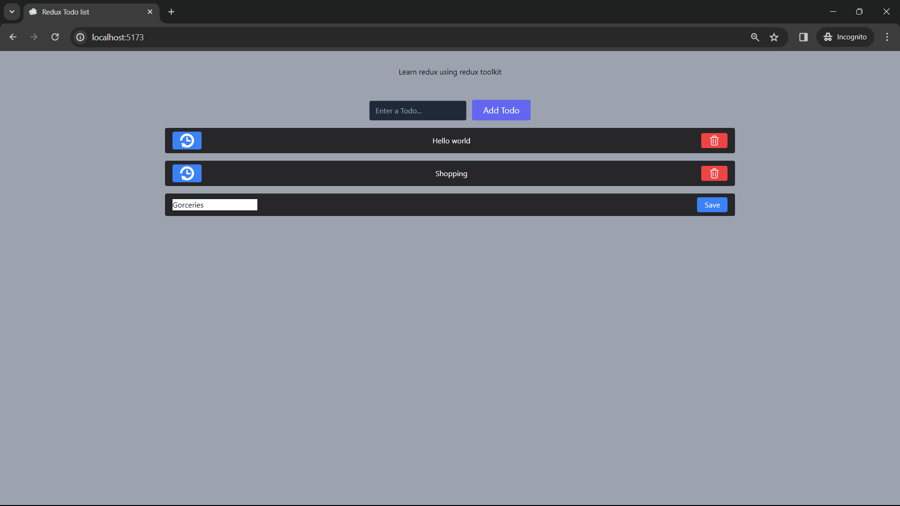

## 🚀 About Me

You can visit....
https://github.com/DATTU005

## Preview



# Redux Todo application

This project is a simple Todo application built using React.js, Tailwind CSS, and Vite.js. It demonstrates the basic functionality of adding, updating, and removing Todos using **Redux Toolkit** for state management. The application consists of components like AddTodo for adding new Todos and Todos for displaying and managing the Todo list.

# Technologies Used

1. React.js: The project is built using the React.js library, which facilitates the creation of interactive and reusable user interfaces.

2. Tailwind CSS: Styling is done using Tailwind CSS, a utility-first CSS framework. This allows for quick and efficient styling without the need for writing custom CSS.

3. Vite.js: The project utilizes Vite.js as the build tool. Vite.js is a fast and opinionated build tool that aims to provide a better development experience for modern web projects.

4. Redux Toolkit: Redux Toolkit is used for state management, providing convenient tools like createSlice and useDispatch to simplify actions and reducers.

# Functionality

The key features of the Currency Exchanger include:

1. Add Todo: Users can input a Todo in the AddTodo component, and upon clicking "Add Todo," the new Todo is added to the list.

2. Remove Todo: Each Todo in the Todos component has a "Remove" button that allows users to delete a specific Todo.

3. Update Todo: Users can click the "Update" button next to a Todo in the Todos component, which toggles between view mode and edit mode, enabling them to update the Todo text.

## Run Locally

Clone the project

```bash
  git clone https://github.com/DATTU005/react-projects.git
```

Go to the project directory

```bash
  cd basic
  cd 04-redux-toolkit-todo
```

Install dependencies

```bash
  npm install
```

Start the server

```bash
  npm run dev
```

Open in the browser: Visit http://localhost:5173 in your browser to see the application.

## 🛠 Skills

Javascript, HTML, Tailwind CSS, React.js, Vite.js, Redux

## Tech Stack

**Client:** React, TailwindCSS, Vite, Redux Toolkit, React-Redux
